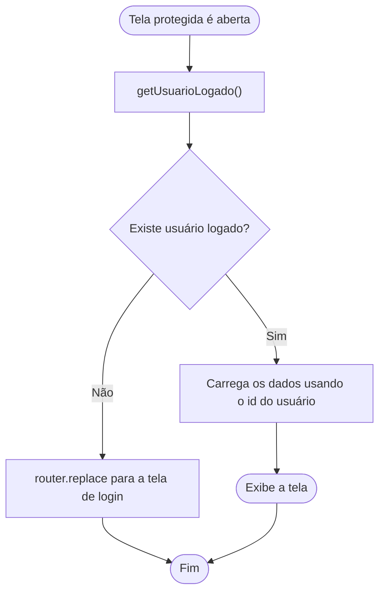
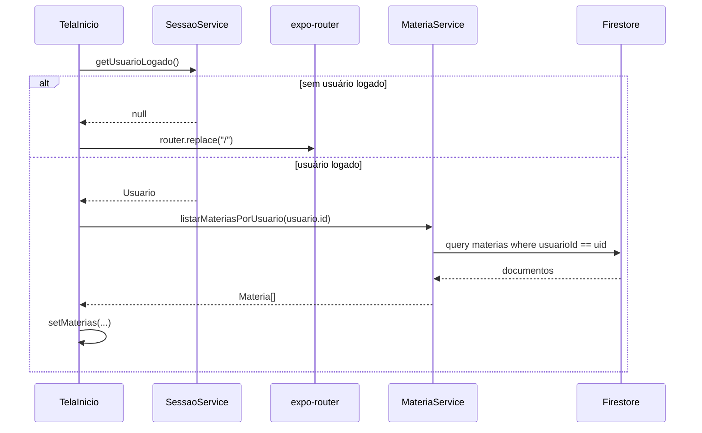
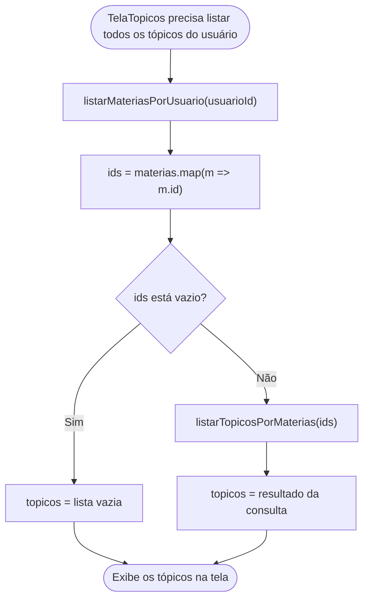
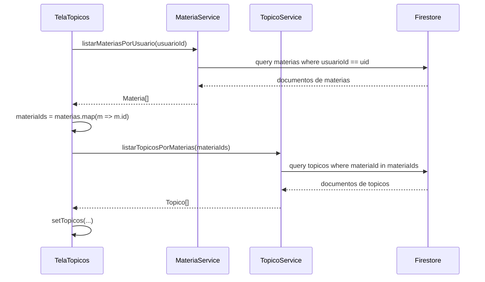

# Aula 13: Usuários e login manual

## Objetivo

Até aqui o diário de estudos tinha um único "dono" implícito: todas as matérias, tópicos e registros pertenciam a todo mundo que abrisse o app. Nesta aula isso muda. Cada matéria passa a pertencer a um usuário específico.

---

## Modelagem: coleção `usuarios` e o campo `usuarioId` em `materias`

Duas coleções novas de conceito, uma de fato nova no banco:

```ts
// types/Usuario.ts
export type Usuario = {
  id: string;
  nome: string;
  email: string;
  dataNascimento: string;
  senha: string;
};
```

```ts
// types/Materia.ts
export type Materia = {
  id: string;
  nome: string;
  descricao: string;
  corDestaque?: string;
  usuarioId: string;   // novo (dono da matéria)
};
```

---

## Consultas no Firestore: E, OU e IN

A aula 11 apresentou `where()` com um único filtro e os operadores de comparação (`==`, `!=`, `<`, `<=`, `>`, `>=`). Nesta aula, duas situações exigem combinar mais de uma condição na mesma consulta: verificar email e senha juntos no login, e filtrar tópicos por uma lista de matérias no "join manual" mais adiante. Vale entender os três jeitos de combinar condições antes de ver esse código nos services.

### E: passar mais de um `where()`

Quando `query()` recebe mais de um `where()`, o Firestore exige que **todas** as condições sejam verdadeiras ao mesmo tempo. Não é preciso nenhuma função especial para isso, a simples presença de dois `where()` já significa "E":

```ts
const q = query(
  collection(db, 'usuarios'),
  where('email', '==', email),
  where('senha', '==', senha)
);
```

Essa consulta só retorna um documento se ele tiver os dois campos batendo ao mesmo tempo. É exatamente o que `buscarUsuarioPorCredenciais` usa mais adiante.

### OU: a função `or()`

Para "qualquer uma destas condições já basta", o Firestore tem uma função explícita, `or()`, importada de `firebase/firestore` junto com `and()` (usada para agrupar condições dentro de um `or()` composto):

```ts
import { query, collection, or, where } from 'firebase/firestore';

const q = query(
  collection(db, 'usuarios'),
  or(where('email', '==', valor), where('apelido', '==', valor))
);
```

Essa consulta retornaria um usuário cujo `email` **ou** cujo `apelido` batesse com `valor`. 

### IN: "este valor está dentro desta lista?"

`in` compara um campo contra uma **lista** de valores possíveis. O documento entra no resultado se o campo bater com qualquer item da lista:

```ts
where('materiaId', 'in', ['idA', 'idB', 'idC'])
```

Isso equivale a perguntar, para cada tópico: "o `materiaId` deste tópico é `idA`, ou `idB`, ou `idC`?". O Firestore limita a lista de `in` a 30 valores por consulta.

É exatamente esse operador que resolve o "join manual" mais adiante: depois de descobrir quais matérias são de um usuário, `in` filtra os tópicos cujo `materiaId` está entre elas.


---

## Cadastro de usuário

`UsuarioService.ts` segue exatamente o padrão de `MateriaService.ts`:

```ts
// services/UsuarioService.ts
import { collection, addDoc, getDocs } from 'firebase/firestore';
import { db } from './firebase';
import { Usuario } from '../types/Usuario';

const COLECAO = 'usuarios';

export async function cadastrarUsuario(dados: Omit<Usuario, 'id'>): Promise<Usuario> {
  const ref = await addDoc(collection(db, COLECAO), dados);
  return { id: ref.id, ...dados };
}
```


```tsx
async function aoCriarConta() {
  if (!nome.trim() || !email.trim() || !dataNascimento.trim() || !senha.trim()) {
    mostrarAlerta('Atenção', 'Preencha todos os campos.');
    return;
  }
  await cadastrarUsuario({ nome, email, dataNascimento, senha });
  mostrarAlerta('Conta criada!', 'Agora você já pode entrar com seu email e senha.');
  router.replace('/');
}
```

---

## Login: consulta ao Firestore, sessão em memória

**Verificar as credenciais** é uma consulta ao Firestore, feita a cada tentativa de login, combinando `email` e `senha` com o "E" visto acima:

```ts
// services/UsuarioService.ts
export async function buscarUsuarioPorCredenciais(email: string, senha: string): Promise<Usuario | undefined> {
  const q = query(collection(db, COLECAO), where('email', '==', email), where('senha', '==', senha));
  const snapshot = await getDocs(q);
  if (snapshot.empty) return undefined;
  const doc = snapshot.docs[0];
  return { id: doc.id, ...doc.data() } as Usuario;
}
```

Se a consulta não encontra nenhum documento com aquele par exato de `email` e `senha`, `snapshot.empty` é `true` e a função retorna `undefined`: não existe usuário com essas credenciais.

**Guardar quem está logado** É responsabilidade do `SessaoService.ts`, um módulo simples que guarda o usuário logado em uma variável:

```ts
// services/SessaoService.ts
import { Usuario } from '../types/Usuario';

let usuarioLogado: Usuario | null = null;

export function logar(usuario: Usuario): void {
  usuarioLogado = usuario;
}

export function deslogar(): void {
  usuarioLogado = null;
}

export function getUsuarioLogado(): Usuario | null {
  return usuarioLogado;
}
```

Na `TelaLogin`, as duas peças se encontram no clique em "Entrar":

```tsx
async function aoEntrar() {
  if (!email.trim() || !senha.trim()) {
    mostrarAlerta('Atenção', 'Preencha email e senha.');
    return;
  }

  const usuario = await buscarUsuarioPorCredenciais(email, senha);
  if (!usuario) {
    mostrarAlerta('Não foi possível entrar', 'Email ou senha incorretos.');
    return;
  }

  logar(usuario);
  router.replace('/inicio');
}
```

---

## Verificando se há um usuário logado

Toda tela protegida (`TelaInicio`, `TelaTopicos`, `TelaNovaMateria`, `TelaNovoTopico`) repete o mesmo roteiro antes de carregar qualquer dado: perguntar ao `SessaoService` quem está logado e, se não houver ninguém, voltar para o login em vez de seguir em frente.

Diagrama de atividade desse roteiro:



E o diagrama de sequência de como isso foi implementado, usando `TelaInicio` como exemplo (as demais telas protegidas seguem o mesmo roteiro):



---

## Isso é inseguro. É proposital, mas precisa ficar dito

Um login assim tem pelo menos dois problemas sérios, e vale nomeá-los explicitamente com a turma:

1. **Senha em texto puro no banco.** Qualquer pessoa com acesso ao console do Firestore lê a senha de qualquer usuário, exatamente como foi digitada. Um sistema real nunca grava a senha em si, grava um *hash* dela (`bcrypt`, `argon2` etc.), de forma que nem o próprio sistema consiga recuperar a senha original, só verificar se uma tentativa bate.
2. **Comparação de senha em texto puro.** `where('senha', '==', senha)` só funciona porque o passo 1 já está errado. A senha precisa estar gravada sem hash para dar para comparar assim, com igualdade exata. Sem hash, não existe comparação segura, seja em memória ou em uma consulta.


---

## Listar matérias e tópicos por usuário: o "join" manual

Em SQL, listar os tópicos de um usuário seria uma consulta só, com `JOIN`:

```sql
SELECT topicos.*
FROM topicos
JOIN materias ON materias.id = topicos.materia_id
WHERE materias.usuario_id = :usuarioId;
```

O Firestore não tem `JOIN`. Uma consulta só enxerga uma coleção. Então o mesmo resultado exige duas consultas em código, uma dependendo do resultado da outra, isso é o "join manual":

```ts
// services/MateriaService.ts
export async function listarMateriasPorUsuario(usuarioId: string): Promise<Materia[]> {
  const q = query(collection(db, COLECAO), where('usuarioId', '==', usuarioId));
  const snapshot = await getDocs(q);
  return snapshot.docs.map((doc) => ({ id: doc.id, ...doc.data() } as Materia));
}
```

```ts
// services/TopicoService.ts
export async function listarTopicosPorMaterias(materiaIds: string[]): Promise<Topico[]> {
  if (materiaIds.length === 0) return [];
  const q = query(collection(db, COLECAO), where('materiaId', 'in', materiaIds));
  const snapshot = await getDocs(q);
  return snapshot.docs.map((doc) => ({ id: doc.id, ...doc.data() } as Topico));
}
```

`listarTopicosPorMaterias` usa exatamente o `in` visto na seção de consultas: filtra `topicos` cujo `materiaId` esteja dentro da lista de ids que `listarMateriasPorUsuario` acabou de devolver.

### Diagrama de atividade do join manual



### Diagrama de sequência de como foi implementado



Na `TelaTopicos`, isso aparece como duas etapas encadeadas: primeiro carrega as matérias do usuário, depois usa os ids delas para buscar os tópicos:

```tsx
useEffect(() => {
  const usuarioLogado = getUsuarioLogado();
  if (!usuarioLogado) {
    router.replace('/');
    return;
  }

  async function carregarMaterias() {
    const materiasCarregadas = await listarMateriasPorUsuario(usuarioLogado!.id);
    setMaterias(materiasCarregadas);
  }

  carregarMaterias();
}, []);

useEffect(() => {
  async function carregarTopicos() {
    const topicosCarregados = materiaId === ''
      ? await listarTopicosPorMaterias(materias.map((m) => m.id))
      : await listarTopicosPorMateria(materiaId);
    setTopicos(topicosCarregados);
  }

  carregarTopicos();
}, [materiaId, materias]);
```

Quando uma matéria específica está selecionada no `Picker`, uma única consulta (`listarTopicosPorMateria`) já basta, o "join" só é necessário para o caso "todas as matérias do usuário".

A `TelaInicio` (lista de matérias) e a `TelaNovaMateria` seguem o mesmo princípio, mas com uma consulta só: `listarMateriasPorUsuario(usuarioLogado.id)`. E `TelaNovoTopico` também passou a carregar só as matérias do usuário logado no `Picker`, sem isso, seria possível criar um tópico apontando para a matéria de outra pessoa.

---

## Uma consequência que já apareceu antes: matérias órfãs

As matérias cadastradas antes desta aula não têm `usuarioId`, elas foram criadas quando essa coluna não existia. Depois desta migração, elas somem de qualquer listagem "por usuário", sem serem apagadas: continuam no Firestore, só não pertencem a ninguém.

Isso é o mesmo fenômeno descrito no `plano-consistencia.md` da atividade B3A1 e na seção "dados órfãos" da aula 12, só que desta vez não é hipotético nem sobre `topicos`/`registros` órfãos de matéria: é sobre matérias órfãs de usuário, visível rodando o próprio app.

---

## Atividade

A atividade desta aula foi movida para [13_usuario_atividade.md](13_usuario_atividade.md).
