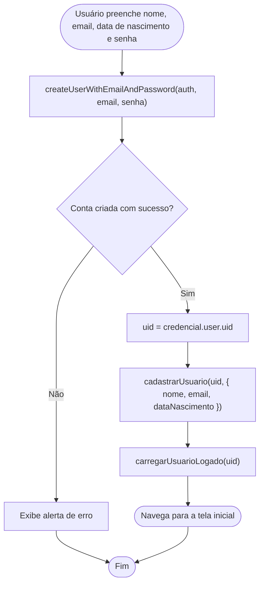
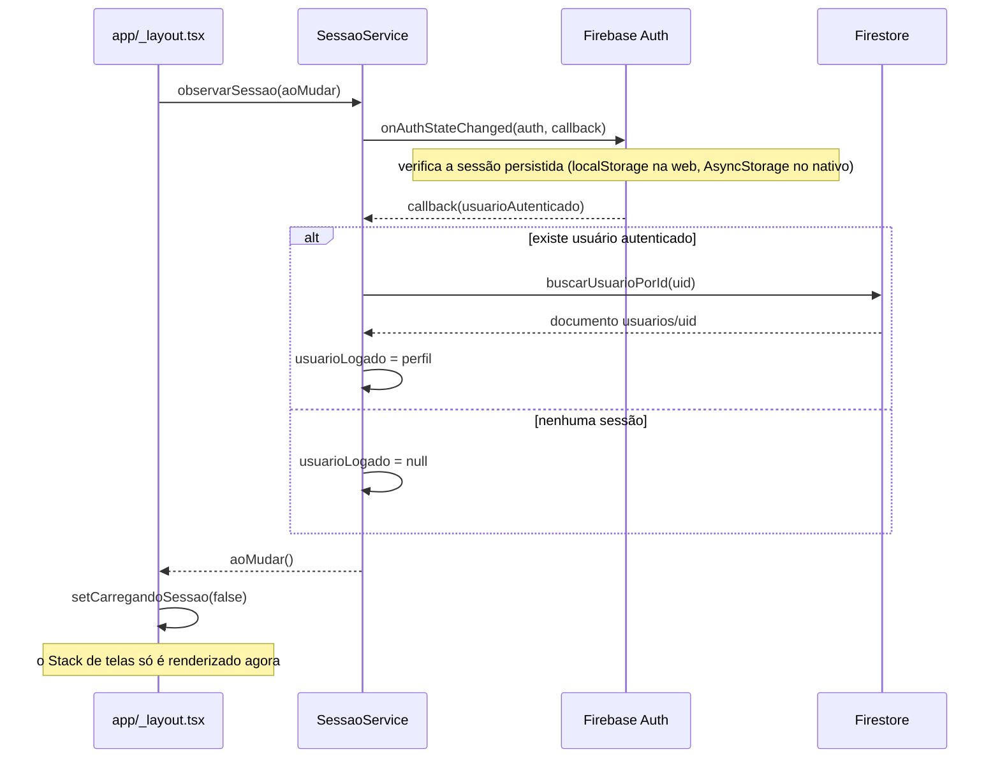

# Aula 14: Firebase Auth

## Objetivo

A aula 13 implementou login na mão, de propósito. Esta aula troca aquele login manual pelo `Firebase Auth`: cadastro e login passam a ser geridos pelo Firebase, e a coleção `usuarios` no Firestore deixa de guardar senha, ela vira só um complemento de perfil sobre uma identidade que agora vive em outro lugar.

---

## Ativando o Auth no console

1. No [console do Firebase](https://console.firebase.google.com), abra o projeto já usado desde a aula 11.
2. No menu lateral, **Build > Authentication**.
3. Clique em **Vamos começar** (ou **Get started**).
4. Na aba **Sign-in method**, escolha o provedor **Email/Password** e ative-o.

Não é criado nenhum projeto novo, nem nenhuma configuração nova. O `firebaseConfig` já usado em `services/firebase.ts` desde a aula 11 (`apiKey`, `authDomain`, `projectId` etc.) é o mesmo para todos os serviços do Firebase, Firestore e Auth incluídos. O que muda é o `app` (já existente, resultado de `initializeApp(firebaseConfig)`) passar a alimentar também uma instância de Auth, não só o Firestore:

```ts
// services/firebase.ts
import { getAuth, initializeAuth } from 'firebase/auth';
// ...

export const app = initializeApp(firebaseConfig);
export const db = initializeFirestore(app, { ignoreUndefinedProperties: true });
export const auth = /* ver seção de persistência abaixo */;
```

---

## Duas coisas distintas: usuário do Auth e documento `usuario`

Este é o ponto mais importante da aula, e vale deixar bem separado:

| | Usuário do Firebase Auth | Documento em `usuarios` (Firestore) |
|---|---|---|
| Quem gerencia | O próprio Firebase, em um serviço separado do Firestore | Seu código, como qualquer outro documento |
| O que guarda | Email, senha (com hash, você nunca vê nem grava o valor real), um identificador único (`uid`) | `nome`, `email`, `dataNascimento`, o que mais o app precisar |
| Como se acessa | `auth.currentUser`, ou o retorno de `createUserWithEmailAndPassword`/`signInWithEmailAndPassword` | `getDoc(doc(db, 'usuarios', id))`, como qualquer leitura no Firestore |
| Apaga o outro ao ser removido? | Não | Não |

São dois sistemas diferentes que só se conectam porque **o código escolhe conectá-los**: ao cadastrar, o `uid` gerado pelo Auth é usado como o id do documento em `usuarios`. Fora essa convenção, não existe vínculo automático, nem cascata, apagar a conta no Auth não apaga o documento no Firestore, e vice-versa. É o mesmo tipo de relação sem chave estrangeira de verdade discutida nas aulas 11 e 13, agora entre `usuarios` e o próprio sistema de autenticação.

A consequência prática: `Usuario` perde o campo `senha`. Ele nunca fez sentido guardar ali, e agora realmente não é mais guardado, quem cuida da senha é o Auth.

```ts
// types/Usuario.ts
export type Usuario = {
  id: string;
  nome: string;
  email: string;
  dataNascimento: string;
};
```

---

## Persistência de sessão: web e nativo não funcionam igual

O Firebase Auth guarda a sessão sozinho (sem precisar de `SessaoService` para isso), mas o **onde** guardar depende da plataforma, e o SDK não escolhe isso por padrão do mesmo jeito nos dois casos:

- Na **web**, `getAuth(app)` já persiste a sessão automaticamente, usando o armazenamento do navegador.
- No **nativo** (iOS/Android), é preciso dizer explicitamente onde guardar, usando o pacote `@react-native-async-storage/async-storage`. Sem isso, a sessão fica só em memória e some ao fechar o app, o mesmo problema que o `SessaoService` da aula 13 tinha por padrão.

Como o app roda nos dois ambientes, `services/firebase.ts` decide qual caminho usar checando `Platform.OS`:

```ts
// services/firebase.ts
import { Platform } from 'react-native';
import { Auth, getAuth, initializeAuth } from 'firebase/auth';
import { getReactNativePersistence } from 'firebase/auth';
import AsyncStorage from '@react-native-async-storage/async-storage';

export const auth: Auth = Platform.OS === 'web'
  ? getAuth(app)
  : initializeAuth(app, { persistence: getReactNativePersistence(AsyncStorage) });
```


---

## Cadastro: criar o usuário do Auth, depois o documento

O fluxo de cadastro passa a ter duas etapas em sequência, não uma: primeiro o Firebase cria a conta de autenticação, depois o app usa o `uid` dessa conta para criar o documento de perfil.



Em código, na `TelaCadastro`:

```tsx
async function aoCriarConta() {
  if (!nome.trim() || !email.trim() || !dataNascimento.trim() || !senha.trim()) {
    mostrarAlerta('Atenção', 'Preencha todos os campos.');
    return;
  }

  try {
    const credencial = await createUserWithEmailAndPassword(auth, email, senha);
    await cadastrarUsuario(credencial.user.uid, { nome, email, dataNascimento });
    await carregarUsuarioLogado(credencial.user.uid);
    router.replace('/inicio');
  } catch (erro) {
    mostrarAlerta('Não foi possível criar a conta', 'Verifique o email e tente novamente.');
  }
}
```

E `cadastrarUsuario`, agora com um `id` recebido de fora (o `uid`), usa `setDoc` em vez de `addDoc`, exatamente como visto na aula 11: `addDoc` é para quando o Firestore deve gerar o id; `setDoc` é para quando você já sabe qual id o documento deve ter.

```ts
// services/UsuarioService.ts
export async function cadastrarUsuario(id: string, dados: Omit<Usuario, 'id'>): Promise<Usuario> {
  const ref = doc(collection(db, COLECAO), id);
  await setDoc(ref, dados);
  return { id, ...dados };
}
```

Dois detalhes que valem nota:

1. `createUserWithEmailAndPassword` já loga a conta recém-criada automaticamente. Por isso o app não manda o usuário para a tela de login depois de se cadastrar, ele já está autenticado, então vai direto para `/inicio`.
2. Se a criação da conta falhar (email já em uso, senha curta demais, etc.), `createUserWithEmailAndPassword` **rejeita a Promise**, em vez de retornar algo como `undefined`. Por isso o `try/catch`, diferente do padrão `if (!resultado)` usado na aula 13.

Os dois primeiros problemas de segurança listados na aula 13 (senha gravada em texto puro, comparação de senha em texto puro) deixam de existir de verdade agora: o app nunca mais grava nem compara senha, isso é inteiramente responsabilidade do Auth, do lado do Firebase.

---

## Login

`signInWithEmailAndPassword` substitui `buscarUsuarioPorCredenciais` da aula 13. A diferença de comportamento é a mesma do cadastro: credenciais erradas rejeitam a Promise, não retornam `undefined`.

```tsx
async function aoEntrar() {
  if (!email.trim() || !senha.trim()) {
    mostrarAlerta('Atenção', 'Preencha email e senha.');
    return;
  }

  try {
    const credencial = await signInWithEmailAndPassword(auth, email, senha);
    await carregarUsuarioLogado(credencial.user.uid);
    router.replace('/inicio');
  } catch (erro) {
    mostrarAlerta('Não foi possível entrar', 'Email ou senha incorretos.');
  }
}
```

---

## Mantendo o usuário logado

Na aula 13, `SessaoService` guardava o usuário logado numa variável, atualizada manualmente por uma função `logar()` chamada só no clique de "Entrar". Isso não persistia entre sessões, era exatamente a limitação que motivou esta aula.

Agora, quem decide se existe sessão é o Firebase Auth, e ele avisa o app através de um listener, `onAuthStateChanged`, que dispara sempre que o estado de autenticação muda: ao logar, ao deslogar, e também **uma vez, de forma assíncrona, assim que o app abre**, com o resultado da sessão persistida (se houver).

```ts
// services/SessaoService.ts
export function observarSessao(aoMudar: () => void): () => void {
  return onAuthStateChanged(auth, async (usuarioAutenticado) => {
    if (usuarioAutenticado) {
      await carregarUsuarioLogado(usuarioAutenticado.uid);
    } else {
      usuarioLogado = null;
    }
    aoMudar();
  });
}
```

Esse "assíncrono assim que o app abre" é a parte que exige cuidado: nos primeiros instantes depois de abrir o app (ou dar refresh na web), o Firebase ainda não confirmou se existe uma sessão salva. Se uma tela como `TelaInicio` checasse `getUsuarioLogado()` nesse meio tempo, ela veria `null` mesmo que o usuário estivesse, de fato, logado, e o mandaria de volta para o login por engano.

A solução é um "portão de carregamento" na raiz do app, em `app/_layout.tsx`: nenhuma tela é montada até a primeira resposta do `onAuthStateChanged` chegar.



```tsx
// app/_layout.tsx
export default function Layout() {
  const [carregandoSessao, setCarregandoSessao] = useState(true);

  useEffect(() => {
    const cancelarObservador = observarSessao(() => setCarregandoSessao(false));
    return cancelarObservador;
  }, []);

  if (carregandoSessao) {
    return (
      <View style={{ flex: 1, justifyContent: 'center', alignItems: 'center' }}>
        <ActivityIndicator />
      </View>
    );
  }

  return (
    <Stack>
      {/* ...telas... */}
    </Stack>
  );
}
```

Com esse portão em um único lugar, as telas protegidas (`TelaInicio`, `TelaTopicos`, `TelaNovaMateria`, `TelaNovoTopico`) continuam chamando `getUsuarioLogado()` exatamente como na aula 13, sem nenhuma mudança nelas, só que agora essa chamada acontece sempre depois que a sessão já foi resolvida, então não existe mais o risco de redirecionar por engano um usuário que já estava logado.

Para testar logout (e conseguir ver a tela de login de novo), `TelaInicio` ganhou um botão "Sair", que chama `deslogar()`:

```ts
// services/SessaoService.ts
export async function deslogar(): Promise<void> {
  await signOut(auth);
}
```

`signOut` também dispara o `onAuthStateChanged`, então o app não precisa fazer mais nada manualmente para "esquecer" o usuário, o mesmo listener que resolve a sessão na abertura do app cuida de zerar `usuarioLogado` no logout.

---

## Testando: web e nativo

O fluxo foi pensado para ser testado principalmente na versão web (`npx expo start --web`), mas funciona sem alteração nenhuma no celular. A diferença inteira entre as duas plataformas fica isolada em `services/firebase.ts` (a escolha de persistência via `Platform.OS`), nenhuma tela precisa saber em qual plataforma está rodando.

Para confirmar que a persistência está funcionando: logue, dê refresh na página (web) ou feche e reabra o app (nativo), a `TelaInicio` deve aparecer direto, sem passar pela tela de login de novo, o portão de carregamento existe exatamente para isso funcionar sem piscar a tela de login no meio do caminho.

---

## Uma consequência que já apareceu antes: usuários órfãos, de novo

Os documentos em `usuarios` criados na aula 13 (com `addDoc`, id gerado pelo Firestore) não correspondem a nenhuma conta real do Firebase Auth, esse `id` nunca foi um `uid`. Toda matéria com `usuarioId` apontando para um desses documentos antigos ficou associada a um usuário que não existe mais como conta autenticável, ninguém consegue logar como ele para acessar aquelas matérias.

É o mesmo fenômeno das matérias órfãs da aula 13 e dos tópicos/registros órfãos da aula 12, uma camada acima: agora é o próprio conceito de usuário que teve sua fonte da verdade trocada, e o que existia antes da troca não se atualiza sozinho.
